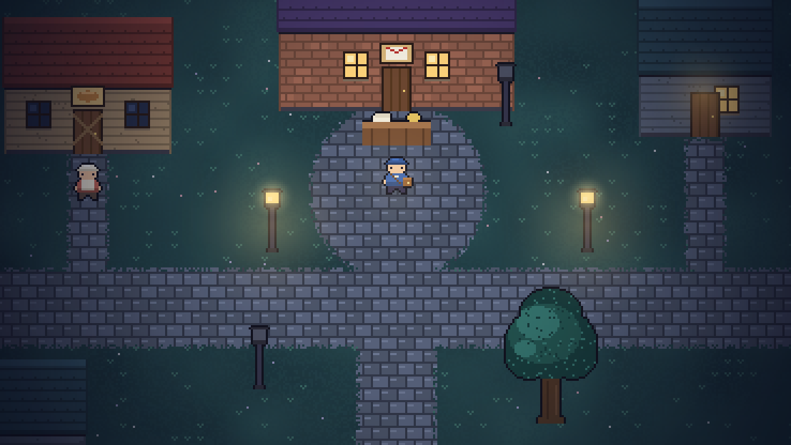
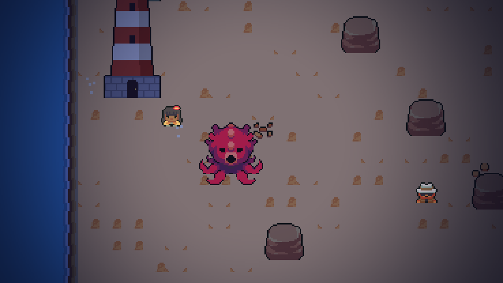

# 달빛 우체국 (Moonlight Post Office)

밤마다 달라지는 섬을 탐험하며 편지를 배달하는 싱글 플레이 2D 탑다운 액션 RPG. Unity로 만든다.
기획서는 [Docs/GameDesign.md](Docs/GameDesign.md)에 있다.

현재 저장소에는 기획서의 **"첫 프로토타입 성공 기준"**(10~15분 분량)을 플레이할 수 있는 코드가 들어 있다.
그림과 소리는 [Ninja Adventure Asset Pack](https://pixel-boy.itch.io/ninja-adventure-asset-pack)(CC0, Pixel-boy & AAA)을 쓰고,
에셋이 없으면 코드로 그린 픽셀 아트(`Assets/Scripts/Art`)로 자동 대체된다. 씬을 직접 만들 필요 없이 Play를 누르면 월드가 코드로 생성된다.
**편집 화면(Scene/Hierarchy)이 비어 있는 것은 정상이다. Play를 눌러야 마을이 나타난다.**




## 실행 방법

1. **Unity Hub → Add → Add project from disk**에서 이 폴더(`RPG_Game`)를 선택한다.
   - **Unity 6000.3.11f1** 기준이다. Unity Hub에서 이 버전을 설치해 두자.
   - 처음 열 때 *"새 Input System을 활성화할까요?"* 창이 뜨면 Yes/No 어느 쪽을 골라도 동작한다.
2. 열린 빈 씬(Untitled)에서 그대로 **Play** 버튼을 누른다.
   - `GameBootstrap`이 자동으로 생성되어 마을·숲·주민·적을 만든다.
   - 마을 위에 **타이틀 화면**(시작하기 / 이어하기 / 새 게임 / 설정 / 종료)이 뜬다.
3. 그림이 흐릿하거나 깨져 보이면 메뉴 **달빛 우체국 → 아트 다시 가져오기**를 누른다.
   (`Assets/Editor/PixelArtImporter.cs`가 픽셀 아트용 가져오기 설정을 자동으로 적용한다.)
4. 한글 폰트로 **Noto Sans KR**(`Assets/Resources/Fonts/UIFont.ttf`, SIL Open Font License)이 들어 있다.
   다른 폰트를 쓰려면 같은 이름으로 바꿔 넣으면 된다.

## 플레이 흐름 (프로토타입)

| 순서 | 내용 |
|---|---|
| 1 | 우체국 창구(E)에서 편지 「밀가루가 묻은 편지」를 받는다. 받는 사람의 주소가 번져 있다. |
| 2 | 마을의 노아에게 물어보거나, 동쪽 숲에서 **터진 밀가루 자루**(단서)를 찾으면 받는 사람이 지도(Tab)에 표시된다. |
| 3 | 숲은 가운데 덤불 때문에 북쪽/남쪽 길로 나뉘며, **밤마다 한쪽이 쓰러진 나무로 막힌다**. 적과 단서 위치도 바뀐다. |
| 4 | 오두막의 오웬에게 편지를 전하며 **선택**(봉투째 건네기 / 소리 내 읽어주기)을 한다. 보상: 우편가방(최대 체력 +2). |
| 5 | 마을로 돌아오면 **빵집이 다시 문을 열고** 미라의 대사가 선택에 따라 달라진다. |
| 6 | 두 번째 편지(오웬의 답장): 마지막 줄을 전부 전할지, 빼고 전할지에 따라 미라가 서 있는 곳이 바뀐다. |
| 7 | 세 번째 편지(우체국장님께): 우체국 앞 **옛 근무표** 단서 → 마을 북쪽 **폐역** 승강장에 나가 있는 옛 우체국장 **도라**에게 배달 → 도라가 집으로 돌아가 불을 켠다. |
| 8 | 네 번째 편지(주소 없는 편지): 녹슨 표지판 단서 → 보스 「먹물 그림자」 → 낡은 우체통에 배달 → **우체국 등불이 켜진다**. |
| 9 | 등불이 켜지면 마을 서쪽 바위가 치워지고 **서쪽 해안**이 열린다. 다섯 번째 편지(등대로 가는 편지)를 들고 등대로. |
| 10 | 등대 앞 바다의 두 번째 보스 「심해 먹물 문어」를 물리치고 등대지기 세린에게 배달 → **등대에 불이 켜지고 섬 전체가 밝아진다**. |
| 11 | 6~12번째 편지: 등대가 켜지자 바다에 가라앉았던 편지가 떠밀려 온다(아래 표). 해안의 **테오**가 모아 우체국으로 보낸다. |
| 12 | 12번째 편지(다 함께 쓴 편지)를 배달하면 광장에 **축제 등불**이 걸리고 주민들이 우체국 앞에 모인다. 여기까지가 1부. |
| 13 | **2부: 터널 너머** — 도라의 편지를 들고 오웬에게 곡괭이를 빌려 북쪽 숲 끝 터널을 뚫는다. 동쪽의 **별빛 고개**가 열린다. |
| 14 | 천문대의 별지기 유나에게서 그림자가 **옛 채석장 갱도**에서 올라온다는 것을 알게 된다. 갱도에는 폭풍 밤에 배달하지 못한 편지들이 잠겨 있다. |
| 15 | 갱도 앞의 세 번째 보스 「부치지 못한 편지의 그림자」를 물리치고 편지들을 다시 '배달 중'으로 돌리면 **섬 전체의 그림자가 줄어든다**. |
| 16 | 마지막 편지(첫 우편 열차를 부르는 편지)를 배달하면 첫 우편 열차가 달린다. 창구에 가면 엔딩(**2종**). |

### 편지 18통 (1부 12통 + 2부 6통)

편지마다 **탐험 과제**가 있다. 들고 있는 편지의 과제는 오른쪽 위 편지 칸에 ○(할 일) / ●(끝낸 일)로 보인다.

| # | 편지 | 보낸 이 → 받는 이 | 탐험 과제 | 선택이 바꾸는 것 |
|---|---|---|---|---|
| 1 | 밀가루가 묻은 편지 | 미라 → 오웬 | 동쪽 숲에서 터진 밀가루 자루(단서) | 미라의 대사 |
| 2 | 오웬의 답장 | 오웬 → 미라 | 숲 입구에 둔 **밀가루 자루**를 함께 가져가기 | 미라가 서 있는 곳, **엔딩** |
| 3 | 우체국장님께 | 오웬 → 도라 | 게시판 근무표(누구) + 도라 집 문의 쪽지(어디) → 폐역 승강장 | 도라의 대사 |
| 4 | 주소 없는 편지 | 노아 → 낡은 우체통 | 녹슨 표지판, **보스 1** | — |
| 5 | 등대로 가는 편지 | 노아 → 세린 | 해안을 지나 **보스 2** | — |
| 6 | 등대지기의 부탁 | 세린 → 테오 | 유리병 무더기(단서), 모닥불을 둘러싼 **박쥐 떼** 쫓기 | 테오의 대사 |
| 7 | 삼 년 늦은 폭풍 경보 | 도라(삼 년 전) → 세린 | 등대의 세린 → 북쪽 갯바위 선착장에서 **램프 기름** | 세린의 대사 |
| 8 | 번진 받는 사람 | 오웬(삼 년 전) → 미라 | 오두막의 초안 묶음(단서), 북쪽 숲 철길 끝으로 날아간 **편지 뒷장** | 미라의 대사 |
| 9 | 첫 반죽과 함께 온 편지 | 미라 → 오웬 | 오두막을 둘러싼 **그림자 떼** 쫓기 | 오웬이 마을로 오는지, **엔딩** |
| 10 | 바다 건너 하나에게 | 테오 → 옛 우편 열차 | 폐역 열차 시간표(단서), 북쪽 숲 신호소의 **우편차 열쇠** | — |
| 11 | 바다를 건너온 답장 | 하나 → 테오 | 비어 있는 모닥불의 발자국(단서) → 북쪽 갯바위 선착장 | — |
| 12 | 다 함께 쓴 편지 | 섬 주민들 → 도라 | 오웬·테오·세린의 **서명** 받기 | 도라가 창구로 돌아오는지 |
| 13 | 터널 너머 고개 역으로 | 도라 → 바우 | 오웬에게 **곡괭이** 빌리기 → 북쪽 숲 끝 **터널 뚫기** | 바우의 대사 |
| 14 | 별지기에게 가는 소포 | 바우 → 유나 | 밤마다 한쪽이 끊어지는 **흔들다리**로 계곡 건너기, 천문대를 둘러싼 **그림자 떼** | 유나의 대사 |
| 15 | 별지기의 관측 일지 | 유나 → 도라 | 옛 채석장의 **그림자 떼**와 먹물이 스민 **우편 자루** | 도라의 대사 |
| 16 | 다시, 배달 중 | 도라 → 갱도 우편 창고 | **보스 3** | — |
| 17 | 삼 년 늦은 생일 카드 | 노아의 할아버지(삼 년 전) → 노아 | 세린에게 노아가 간 곳 묻기 → 천문대 | 노아의 대사 |
| 18 | 첫 우편 열차를 부르는 편지 | 도라 → 바우 | 채석장의 **석탄 자루**, 북쪽 숲 신호소의 **선로 전환기** | — |

### 의뢰 (곁가지 일거리)

주민 이름 위에 **[의뢰]** 가 붙어 있으면 말을 걸어 의뢰를 받을 수 있다. 편지와 달리 여러 개를 함께 맡을 수 있고,
하지 않아도 이야기는 끝까지 간다. 진행 중인 의뢰는 편지 칸 아래 **의뢰 칸**에, 받을 수 있는 의뢰와 끝낼 의뢰는 지도(Tab)에 보인다.
할 일을 마치면 이름 위에 **[의뢰 완료]** 가 뜬 주민에게 돌아가자.

| 의뢰 | 주는 사람 | 받을 수 있는 때 | 할 일 | 보상 |
|---|---|---|---|---|
| 잃어버린 반죽 그릇 | 미라 | 빵집이 다시 열린 뒤 | 동쪽 숲 남쪽 길 끝에서 반죽 그릇 찾기 | 크루아상 3, 이후 진열대가 밤마다 하나 더 |
| 신호소의 그림자 둥지 | 오웬 | 2번째 편지 뒤 | 북쪽 숲 신호소 공터의 그림자 무리 물리치기 | 오웬의 산길 장화(회피 +25%) |
| 옛 날짜 도장 | 도라 | 3번째 편지 뒤 | 폐역 역사 뒤에서 날짜 도장 찾기 | 우체국장의 날짜 도장(편지 도구 +25%) |
| 터널의 기적 소리 | 노아 | 3번째 편지 뒤 | 북쪽 숲 무너진 터널 살펴보기 | 노아의 종이배(회피 +10%) |
| 등대 렌즈 조각 | 세린 | 등대에 불이 켜진 뒤 | 북쪽 갯바위 물웅덩이에서 렌즈 조각 찾기 | 등대 렌즈 부적(최대 체력 +1) |
| 빵집 아가씨에게 온 병 편지 | 테오 → 미라 | 6번째 편지 뒤 | 테오가 맡긴 병 편지를 미라에게 전하기 | 크루아상 2, 미라의 어머니 이야기 |
| 멈춘 역 시계 | 바우 | 13번째 편지 뒤 | 옛 채석장 남동쪽 구석에서 태엽 열쇠 찾기 | 역장의 회중시계(편지 도구 +15%) |
| 흩어진 별지도 | 유나 | 14번째 편지 뒤 | 북쪽 갯바위·폐역·북쪽 숲에 흩어진 별지도 세 장 모으기 | 작은 별지도(밤 시야 확대) |

의뢰 정의는 `Assets/Resources/Data/requests.json`(받는 조건 `condition`, 할 일 `objectives`, 끝낼 조건 `completeCondition`,
대사, 보상), 필요한 물건·사건의 배치는 `GameBootstrap.Tasks.cs`의 `BuildRequestTasks()`에 있다.

**엔딩**: 18번째 편지까지 배달한 뒤(`train_runs`) 창구에 가면 엔딩이 나온다. 2번째 편지에서 마지막 줄을 빼고 전했거나(`reply_softened`),
9번째 편지에서 "꼭 와 달라는 얼굴"이라고 전하면(`owen_comes`) **엔딩 A: 다시 이어진 길**, 아니면 **엔딩 B: 매주 오는 편지**.

### 주민 8명

| 주민 | 있는 곳 | 비고 |
|---|---|---|
| 미라 | 빵집 앞 | 빵집 주인. 오웬의 동생 |
| 노아 | 바닷가 → (등불 후) 우체국 앞 (17번째 편지의 밤에는 천문대) | 어부의 아들. 세린의 아들 |
| 오웬 | 숲 끝 오두막 → (`owen_comes`) 빵집 옆 | 옛 야간 우체부 |
| 세린 | 등대 앞 → (등대 불 후) 우체국 앞 | 등대지기 |
| 도라 | 폐역 승강장 → (3번째 편지 후) 마을 서남쪽 집 앞 → (축제) 우체국 앞 | 옛 우체국장 |
| 테오 | 서쪽 해안 북쪽 유목 곁 → (축제) 마을 | 유리병을 줍는 떠돌이 선원 |
| 바우 | 별빛 고개 역 승강장 → (첫 열차 후) 폐역 승강장 | 고개 역장. 도라의 옛 동료 |
| 유나 | 계곡 건너 천문대 앞 | 별지기. 그림자가 어디서 오는지 별로 잰다 |

## 조작

| 입력 | 동작 |
|---|---|
| WASD / 방향키 | 이동 |
| 마우스 왼쪽 / J | 공격 (바라보는 방향, 3번 이어 치면 마지막이 강타) |
| Space / Shift | 회피 (짧은 무적) |
| 마우스 오른쪽 / K (누르고 있기) | 우편가방 막기 — 맞기 직전에 누르면 **받아치기** |
| E | 조사 · 대화 · 배달 / 대화 넘기기 |
| Q | 편지 도구 사용 (끼운 부품에 따라 효과가 다름) |
| C | 편지 도구 부품 바꾸기 |
| 1~3 / 클릭 | 선택지 고르기 |
| Tab / M | 지도와 의뢰 (게임 일시정지) |
| I | 가방 (가진 아이템 보기, 일시정지) |
| R | 크루아상 먹기 (체력 3 회복) |
| Esc | 메뉴(계속하기 · 설정 · 타이틀로 · 저장하고 종료). 지도·가방이 열려 있으면 닫기 |
| F1 | 조작법 보이기/숨기기 |
| F11 | 다음 편지로 건너뛰기 (개발용, 에디터·개발 빌드에서만: 편지가 없으면 받고, 있으면 첫 번째 선택지로 바로 배달) |
| F12 | 저장 삭제 후 새 게임 (개발용, 에디터·개발 빌드에서만) |

### 설정 (타이틀 또는 Esc 메뉴)

배경음악·효과음 음량, 화면 흔들림, 시작할 때 조작법 안내, 전체 화면. 진행 상황(저장 파일)과 따로 `PlayerPrefs`에 저장된다.
메뉴는 마우스로도, 키보드(W/S 고르기 · A/D 값 바꾸기 · Enter/Space/E 결정 · Esc 뒤로)로도 조작한다. (`UI/GameMenu.cs`, `Core/Settings.cs`)

### 전리품 · 황금 그림자 · 강화

싸울수록 강해지는 순환: **그림자를 잡는다 → 재료가 튀어나온다 → 장비를 강화한다 → 더 센 황금 그림자를 잡는다.**

- **전리품**: 그림자를 쓰러뜨리면 **먹물 결정**이 통통 튀어나오고, 가까이 가면 빨려 들어온다. 가끔 **달빛 조각**(희귀)도 나온다.
  한 번만 열리는 상자도 결정을 쏟아낸다. 보스는 결정과 조각을 잔뜩 떨어뜨린다. 가진 재료는 왼쪽 위에 보인다.
- **황금 그림자**: 둘째 밤부터 밤마다 열린 지역 중 한 곳에 금빛 그림자가 하나 나타난다(새 밤 알림, 지도의 ★).
  일반 그림자보다 4배 튼튼하고 빠르다. 쓰러뜨리면 결정 12~18개, 조각 2~4개, **황금 그림자 증표**를 쏟고,
  20% 확률로 **전설 장비**가 빛기둥과 함께 떨어진다. 증표 4개마다 한 번은 반드시 나온다(천장). 그 밤에 잡지 않으면 사라진다.
- **전설 장비 4종**: 유성의 심장(최대 체력 +2), 혜성 깃펜(편지 도구 +40%), 은하 깃털(회피 +40%), 오로라 등불(밤 시야 +2).
- **강화**: 우체국 오른쪽 **강화 작업대(모루)**에서 장비와 편지 도구를 +1 ~ +5까지 강화한다.

| 단계 | 먹물 결정 | 달빛 조각 | 성공 확률 |
|---|---|---|---|
| +0 → +1 | 10 | — | 100% |
| +1 → +2 | 20 | — | 85% |
| +2 → +3 | 35 | 1 | 65% |
| +3 → +4 | 55 | 2 | 45% |
| +4 → +5 | 80 | 3 | 30% |

  실패하면 재료만 사라지고 장비는 그대로이며, 그 장비의 다음 성공 확률이 +10%씩 오른다(성공하면 초기화).
  단계당 효과: 회피 +5%p, 편지 도구 +6%p, 밤 시야 +0.25, 최대 체력은 +3·+5에서 +1씩, 편지 도구 부품은 끼웠을 때 위력 +8%.
  이름 색: +1~2 초록, +3~4 파랑, +5 주황, 전설은 금색 ★. (`World/Upgrade.cs`, `World/Loot.cs`, `UI/UpgradeMenu.cs`, 황금 그림자는 `NightDirector.SpawnGolden`)

### 철길 빠른 이동

13번째 편지를 배달하면 바우가 **철길 손수레**를 내준다. **폐역 · 북쪽 숲 신호소 · 고개 역** 철길 위의 손수레에 말을 걸어
다른 정거장으로 바로 갈 수 있다. 첫 우편 열차가 달린 뒤에는 **우편 열차**가 된다. (`World/RailStop.cs`, 정거장 위치는 `GameBootstrap.East`)

전투 규칙: 적은 **예고 표시**가 끝난 뒤에만 피해를 준다.

- **빨간색**(돌진): 회피하거나 우편가방으로 **막을 수 있다**. 막으면 적이 튕겨 나간다.
- **주황색**(보스의 내려찍기): **막을 수 없다**. 회피하거나, 맞기 직전에 막기를 눌러 **받아치기**만 통한다.
- **받아치기**: 막기를 누른 직후(0.2초 안)에 공격이 닿으면 적이 크게 비틀거리고 피해를 입는다.
- **3연타**: 공격을 이어서 3번 하면 마지막 타가 크고 강하다(피해 2, 크게 밀어냄).

### 적 (일반 3종 + 보스)

| 적 | 행동 | 공략 |
|---|---|---|
| 그림자 들쥐 | 다가와서 돌진(빨간 띠) | 막거나 옆으로 피한 뒤 3연타 |
| 먹물 박쥐 | 거리를 두고 옆으로 돌며 먹물 구슬을 쏜다(얇은 빨간 선) | 막거나, **받아치면 구슬이 되돌아가** 박쥐를 맞힌다. 날아가는 편지로 저격 |
| 그림자 두더지 | 땅속(흙더미)으로 다가와 발밑에서 튀어나오며 내려찍기(주황 원, 막을 수 없음) | 흙더미가 다가오면 피하고, 튀어나온 뒤 1.5초 무방비일 때 공격 |
| 먹물 그림자(보스 1) | 내려찍기 · 돌진 · 먹물 구슬 | 주황 원은 회피/받아치기, 나머지는 막기 |
| 부치지 못한 편지의 그림자(보스 3) | 내려찍기 · 부채꼴 구슬 4발 · 돌진, 그리고 **보라색 원**을 그리며 작은 그림자(들쥐·박쥐)를 불러낸다. 체력 절반 아래에서 분노 | 보라색 원은 피해가 없는 틈이니 이때 공격. 불러낸 그림자는 보스를 쓰러뜨리면 함께 사라진다 |
| 심해 먹물 문어(보스 2) | 부채꼴 구슬 3발 · 촉수 내리꽂기(주황 원이 차례로 차오름) · 물속으로 잠겨 다가와 튀어나오기. 체력 절반 아래에서 **분노**(빨라지고 구슬 5발, 촉수 5개) | 구슬은 막기/받아치기로 되돌리기, 촉수는 원 밖으로, 웅덩이가 다가오면 회피 후 튀어나온 직후 공격 |

첫 밤에는 들쥐, 다음 밤부터 박쥐, 둘째 밤부터 숲 끝에 두더지가 나온다. 폐역과 북쪽 숲에도 밤마다 그림자들이 나온다.
터널 너머의 별빛 고개와 옛 채석장은 그림자가 가장 짙다. 16번째 편지로 갱도의 편지를 풀어 주면(`shadows_calm`) 섬 전체의 적이 줄어든다.

### 지역

섬은 옛 마을·숲·해안이 있는 남쪽과, 옛 철길이 가로지르는 **북쪽 띠**로 나뉜다. 둘 사이 능선에는 틈이 세 군데 있다.
2부에서는 철길이 끝나는 터널 너머 동쪽(별빛 고개·옛 채석장)이 열려 지도가 1.3배로 넓어진다.

| 지역 | 가는 길 | 볼거리 |
|---|---|---|
| 마을 | 시작 위치 | 우체국, 빵집, 주민들 |
| 동쪽 숲 | 마을 동쪽 문 | 밤마다 북쪽/남쪽 길 중 하나가 쓰러진 나무로 막힘. 오웬의 오두막, 낡은 우체통, 보스 1 |
| 서쪽 해안 | 마을 서쪽 (우체국 등불 후) | 등대, 테오의 모닥불, 보스 2 |
| **폐역** (세 번째 지역) | 마을 북동쪽 길 | 울타리 친 철길을 건널목 두 곳으로만 건넌다. **밤마다 한쪽 건널목이 잔해로 막힌다.** 승강장·역사·옛 우편 열차, 역무실 사물함 |
| 북쪽 숲 | 폐역 철길 동쪽 / 동쪽 숲 북쪽 길의 샛길 | 철길 끝의 무너진 터널, 옛 신호소 공터와 공구함 |
| 북쪽 갯바위 | 서쪽 해안 절벽 틈 (해안과 함께 열림) | 물웅덩이, 옛 우편 선착장과 상자 |
| **별빛 고개** (네 번째 지역) | 북쪽 숲 끝 터널 (13번째 편지에서 뚫음) | 고개 역(바우), 고개 마을. 남북으로 흐르는 계곡을 흔들다리로 건넌다. **밤마다 한쪽 다리가 끊어진다.** 건너편 꼭대기에 천문대(유나) |
| 옛 채석장 | 고개 마을 남쪽 틈 | 먹물 웅덩이, 채석장 오두막, 동쪽 끝의 옛 갱도(우편 창고)와 보스 3 |

### 밤의 종류

편지를 받아 새 밤이 시작될 때마다 밤의 분위기가 정해진다.

| 밤 | 효과 |
|---|---|
| 맑은 밤 | 보통 |
| 안개 낀 밤 | 보이는 범위가 좁아지고 적이 하나 더 나온다 |
| 반딧불이 밤 | 숲에 반딧불이가 가득해 넓게 보이고 적이 하나 줄어든다 |
| 보름달 밤 | 잃어버린 우표가 밝게 반짝이고 **지도(Tab)에 표시된다** |

### 잃어버린 우표 (숨은 수집품 8장)

섬 곳곳(건물 뒤, 덤불 사이, 폐역·북쪽 숲·북쪽 갯바위의 구석)에 숨어 있다. 닿기만 하면 줍는다.
4장을 모으면 **우표 수집가 배지**(최대 체력 +1), 8장을 모두 모으면 **황금 우표**(편지 도구 강화)를 받는다.

### 편지 도구 부품 (Q / C)

기획서의 "편지 도구 스킬 1개 + 효과를 바꾸는 부품"을 따른다. Q는 하나지만 끼운 부품에 따라 효과가 바뀐다.

| 부품 | 얻는 곳 | Q 효과 | 재사용 대기 |
|---|---|---|---|
| 봉인끈 | 처음부터 | 주변 적을 묶음 (보스는 절반) | 6초 |
| 속달 봉투 | 두 번째 편지를 받을 때 창구 서랍에서 | 바라보는 방향으로 내달리며 지나간 적을 치고 비틀거리게 함, 무적 | 3.5초 |
| 날아가는 편지 | 두 번째 편지 배달 보상(미라) | 편지를 던져 멀리 있는 적을 맞힘 (피해 2) | 1.6초 |

은빛 봉인 인장(장비)이 있으면 모든 부품의 재사용 대기가 줄고 위력이 오른다. 쓰러지면 우체국 앞에서 다시 시작하고 편지는 유지된다.
우체국 창구에 말을 걸면 체력이 회복된다. 진행 상황은 편지를 받거나 배달할 때 자동 저장된다.

## 아이템

경험치 대신 **장비와 도구**로 강해진다. 장비는 가지고 있기만 하면 효과가 계속 적용된다.
아이템 정의는 `Assets/Resources/Data/items.json`에서 고친다.

| 아이템 | 종류 | 얻는 곳 | 효과 |
|---|---|---|---|
| 오웬의 우편가방 | 장비 | 첫 편지 배달 보상 | 최대 체력 +2 |
| 깃털 깔창 | 장비 | 첫 배달 뒤 노아에게 말 걸기 | 회피 시간 +40% |
| 은빛 봉인 인장 | 장비 | 숲 북서쪽 잠긴 상자 | 봉인끈 지속 +50%, 재사용 대기 단축 |
| 반딧불이 병 | 장비 | 오웬 오두막 뒤 상자 | 밤에 밝게 보이는 범위 확대 |
| 오두막 상자 열쇠 | 열쇠 | 첫 배달 뒤 오웬에게 말 걸기 | 잠긴 상자 열기 |
| 오웬의 폭풍 등불 | 장비 | 9번째 편지 배달 보상 | 밤에 밝게 보이는 범위 확대 |
| 하나의 바다 유리 | 장비 | 11번째 편지 배달 보상 | 최대 체력 +1 |
| 오웬의 산길 장화 | 장비 | 의뢰「신호소의 그림자 둥지」 | 회피 시간 +25% |
| 우체국장의 날짜 도장 | 장비 | 의뢰「옛 날짜 도장」 | 편지 도구 위력·재사용 대기 +25% |
| 노아의 종이배 | 장비 | 의뢰「터널의 기적 소리」 | 회피 시간 +10% |
| 등대 렌즈 부적 | 장비 | 의뢰「등대 렌즈 조각」 | 최대 체력 +1 |
| 별모래 주머니 | 장비 | 14번째 편지 배달 보상 | 최대 체력 +1 |
| 야간 우체부 배지 | 장비 | 16번째 편지 배달 보상 | 최대 체력 +1 |
| 노아의 별똥별 돌 | 장비 | 17번째 편지 배달 보상 | 회피 시간 +15% |
| 역장의 회중시계 | 장비 | 의뢰「멈춘 역 시계」 | 편지 도구 위력·재사용 대기 +15% |
| 작은 별지도 | 장비 | 의뢰「흩어진 별지도」 | 밤에 밝게 보이는 범위 확대 |
| 미라의 크루아상 | 소모품 | 빵집 진열대(밤마다 2개, 최대 5개) | R 키로 체력 3 회복 |

- 대사 조건에 `has:아이템id`(가지고 있음), `got:아이템id`(한 번이라도 얻음)를 쓸 수 있다.
- 주민이 아이템을 주게 하려면 `npcs.json`의 대사에 `"giveItem": "아이템id"`를 넣고,
  조건에 `!got:아이템id`를 넣어 한 번만 주게 한다.
- 편지 배달 보상은 `letters.json`의 `rewardItem`.

## 폴더 구조

```
Assets/
  Editor/                PixelArtImporter(픽셀 아트 가져오기 설정 자동 적용)
  Resources/Art/NinjaAdventure/  ← 사용하는 에셋만 골라 넣은 것(타일셋, 캐릭터, 얼굴, 효과, 음악·효과음, 라이선스)
  Resources/Data/        ← 스토리 데이터(JSON). 대사·편지·단서는 여기서 고친다.
    letters.json         편지(받는 조건, 단서 플래그, 배달 선택지, 결과 플래그, 보상)
    npcs.json            주민 대사(조건별, 위에서부터 처음 맞는 대사 사용)
    clues.json           단서
    items.json           아이템(장비·열쇠·소모품)
  Scripts/
    Core/                GameBootstrap(월드 생성: 마을·숲 / .Coast 해안·등대 / .North 폐역·북쪽 숲·북쪽 갯바위 /
                         .East 별빛 고개·옛 채석장 / .Story 도라·테오·단서·축제 / .Tasks 편지·의뢰의 과제),
                         GameState(플래그·저장), GameInput, 공용 유틸
    Data/                JSON 데이터 정의와 로더
    Player/              PlayerController(이동·공격·회피·봉인끈·조사)
    Combat/              Health, EnemyController(예고 → 돌진/내려찍기, 기절, 보스 슈퍼아머)
    World/               LetterManager(핵심 루프), NightDirector(밤마다 바뀌는 숲),
                         WorldVisuals(플래그에 따른 마을 변화), Interactables, Spawner
    UI/                  HUD(체력·편지·지도·알림), DialogueSystem(대화·선택지)
    Art/                 GameAssets(에셋 자르기·불러오기), SpriteAnimator(4방향 걷기),
                         코드로 그린 대체 그림(Art, GroundPainter), 반딧불이
Docs/GameDesign.md       기획서
```

## 이야기를 확장하는 방법

모든 분기는 **문자열 플래그**로 처리된다. 조건 문법: `a,b` = a 그리고 b, `!a` = a가 아님, `a,b|c` = (a 그리고 b) 또는 c,
`carrying:편지id` = 그 편지를 들고 있음, `delivered:편지id` = 배달 완료.

- **편지 추가**: `letters.json`에 항목을 추가한다. `condition`으로 언제 받을 수 있는지, `revealFlag`(조건)로 어떤 단서를 찾아야 받는 사람이 공개되는지, `choices[].setFlag`와 `deliveredFlag`로 배달 결과를 정한다.
- **탐험 과제**: `objectives`(`text` + `condition`)는 화면에 보이는 목록이고, 실제로 배달을 막는 것은 `deliverCondition`과 `blockedLines`다.
  과제의 재료는 네 가지다(`GameBootstrap.Tasks.cs`).
  - 찾아 올 물건: `QuestItem(편지id, 아이템id, 위치, ...)` → 조건 `has:아이템id`, 배달 때 없애려면 `consumeItems`
  - 작은 사건: `director.encounters`에 `EncounterSpec`(그 편지를 들고 있을 때 나오는 적 무리) → 모두 물리치면 `flag`
  - 대화: `npcs.json` 대사의 `setFlag`(+`toast`) → 예: 서명 `sign:owen`
  - 받는 사람에게 막힌 채 말을 걸면 `met:편지id`가 선다(예: "등대의 세린 찾아가기")
- **대사 변화**: `npcs.json`의 `talks`에 조건과 대사를 추가한다. 더 구체적인 조건을 위쪽에 둔다.
- **마을 풍경 변화**: `GameBootstrap.BuildVillage()`에서 `WorldVisuals.Register(오브젝트, "조건")`으로 등록한다.
- **새 주민/단서 위치**: `Spawner.Npc(...)`, `GameBootstrap.Clue(...)`. 이야기 중반 이후의 것은 `GameBootstrap.Story.cs`에 모아 두었다.
  단서는 `WorldVisuals.Register(Clue(...).gameObject, "delivered:앞편지id")`처럼 등록해 이야기보다 먼저 발견되지 않게 한다.
- **적 종류**: `Spawner.Enemy`에서 `EnemyController`의 수치와 `pattern`(Lunge/Slam 조합)을 바꿔 만든다.

## 배포용 빌드

메뉴 **달빛 우체국 → 배포용 빌드 (Windows)** (또는 명령줄
`Unity.exe -batchmode -quit -projectPath . -executeMethod MoonlightPost.EditorTools.ReleaseBuild.Build`).

- 결과: `Build/Release/MoonlightPost/`(실행 파일)과 이를 묶은 `Build/MoonlightPost_v버전_Windows.zip`(읽어보기.txt 포함).
- 개발 빌드가 아니므로 "Development Build" 표시와 개발용 키(F11 건너뛰기, F12 저장 삭제)가 빠진다.
- 제품 이름·버전·아이콘·창 설정은 `Assets/Editor/ReleaseBuild.cs`에서 빌드할 때마다 적용한다(버전은 `Version`).
  아이콘은 `Assets/Editor/AppIcon.png`.

## 자동 플레이테스트

편지 18통을 실제 게임 코드로 끝까지 진행하며 막힌 곳을 찾고 스크린샷을 남긴다(`Assets/Scripts/Dev/Playtest.cs`).
1회차는 선택지를 모두 첫 번째로, 2회차는 섞어서 골라 엔딩 2종을 모두 본다.

1. 빌드: 메뉴 **달빛 우체국 → 자동 플레이테스트 빌드** (또는 명령줄
   `Unity.exe -batchmode -quit -projectPath . -executeMethod MoonlightPost.EditorTools.PlaytestBuild.Build`)
2. 실행: `Build/Playtest/MoonlightPost.exe -screen-fullscreen 0 -playtest 결과폴더`
3. 결과: `report.txt`(편지별 이동 거리·대사 수, 걸어서 닿을 수 없는 대상, 엔딩), `transcript.txt`(모든 대사와,
   배달마다 주민 전원에게 말을 건 기록), 장면별 스크린샷 `*.png`.

플레이어의 저장 파일은 건드리지 않는다(별도 파일을 쓰고 끝나면 지운다). `-playtest` 없이 실행하면 평소와 같다.

## 다음 단계 (기획서 제작 순서 기준)

- [x] 1. 핵심 플레이 샘플 — 편지 수령 → 단서 → 배달 → 결과
- [x] 2. 전투 샘플 — 공격·회피·봉인끈, 적 공격 예고, 피격·리스폰
- [x] 3. 작은 완성 구역 — 마을 + 동쪽 숲(밤마다 변하는 길)
- [x] 4. 스토리 수직 단면 — 편지 3통, 주민 2명(+오웬), 보스 1종
- [ ] 이 프로토타입을 플레이해 보고 **"다음 편지가 궁금해지는가"** 확인
- [x] 임시 도형 → 코드로 그린 픽셀 아트, 밤 조명(가장자리 어둠·등불·반딧불이)
- [x] 에셋 적용: 타일 바닥(자동 타일), 건물·나무, 4방향 걷기 캐릭터, 대화 초상화, 효과음·배경음악
- [ ] 코드로 만드는 지형 → Unity 에디터에서 직접 편집하는 Tilemap 씬
- [x] 장비·도구 시스템: 아이템 6종, 가방 화면, 상자, 소모품
- [x] 일반 적 3종(들쥐·박쥐·두더지), 받아치기로 구슬 되돌리기
- [x] 밤의 종류(안개·반딧불이·보름달), 숨은 수집품(잃어버린 우표 8장)
- [x] 두 번째 보스(심해 먹물 문어), 서쪽 해안·등대 지역, 네 번째 편지, 엔딩 2종
- [x] 편지 12통·주민 6명(도라·테오 추가)·엔딩 2종으로 이야기 확장
- [x] 세 번째 지역(폐역)과 북쪽 띠(북쪽 숲·북쪽 갯바위)로 지도 두 배 확장, 편지 3·10을 폐역으로
- [x] 자동 플레이테스트로 12통 전체 진행·도달 가능 여부 점검
- [x] 편지마다 탐험 과제(찾아 올 물건 4종, 작은 사건 2개, 두 단계 추리 2통, 서명 모으기) — 편지 하나당 걷는 시간 약 2배
- [x] 주민 의뢰 6개(곁가지 일거리): 찾아 오기 3, 그림자 무리 1, 조사 1, 다른 주민에게 전하기 1
- [x] 2부(편지 6통): 네 번째 지역 별빛 고개·옛 채석장, 주민 2명(바우·유나), 보스 3, 밤마다 끊어지는 흔들다리, 의뢰 2개
- [ ] 분량: 18통 전체가 걷는 시간만 약 12분(1부 7분 + 2부 5분), 대사·전투를 더해 1시간 30분~2시간 정도로 본다.
      기획서 목표(6~8시간)까지는 아직 멀다. 3부(바다 건너 / 봄의 배)나 밤마다 바뀌는 반복 배달이 다음 후보
- [x] 전리품(먹물 결정·달빛 조각), 밤마다 나오는 황금 그림자와 전설 장비 4종, 확률 강화(+1~+5, 실패 보정)
- [x] 타이틀 화면 · 일시정지 메뉴 · 설정(음량, 화면 흔들림, 조작법 안내, 전체 화면), 철길 빠른 이동(정거장 3곳)
- [ ] 사람이 직접 하는 플레이테스트: 전투 난이도, "다음 편지가 궁금해지는가"

## 에셋 사용법과 출처

- 사용 에셋: **Ninja Adventure Asset Pack** — Pixel-boy & AAA, CC0 ([itch.io](https://pixel-boy.itch.io/ninja-adventure-asset-pack)).
  라이선스 전문은 `Assets/Resources/Art/NinjaAdventure/LICENSE.txt`.
- 게임에서 실제로 쓰는 파일만 `Assets/Resources/Art/NinjaAdventure/`에 넣었다(약 12MB). 원본 압축 파일은 저장소에 넣지 않는다.
- 주민 그림: 미라 Woman, 노아 Child, 오웬 Hunter, 세린 Princess, 도라 OldWoman, 테오 OldMan, 바우 OldMan2, 유나 SorcererBlack.
  보스: 먹물 그림자 GiantSpirit, 심해 먹물 문어 Squid, 부치지 못한 편지의 그림자 GiantSlime(보랏빛으로 물들임).
- 지역별 음악(`Audio/Music`): 마을 Village, 숲 Forest, 해안·북쪽 갯바위 Coast(18 - Aquatic), 폐역 Station(30 - Ruins),
  별빛 고개 Pass(22 - Dream), 옛 채석장 Quarry(2 - The Cave), 보스 Boss, 첫 열차 뒤의 마을 Ending(8 - End Theme). `Sound.cs`의 `RegionMusic`.
- 어떤 그림을 쓰는지는 타일 좌표로 정해져 있다(`GameBootstrap.Assets.cs`, `GameAssets.cs`).
  예: `GameAssets.Tile("TilesetHouse", 25, 7, 4, 7)` = 집 타일셋의 (25, 7) 칸부터 가로 4칸·세로 7칸(우체국).
- 다른 캐릭터로 바꾸려면 원본 팩의 `Actor/Character/이름/SpriteSheet.png`를 `Actors/이름.png`로 복사하고,
  `GameBootstrap`의 `Spawner.Npc(..., "이름")`을 바꾼다.
